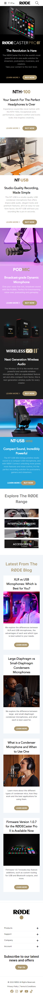

## RODE Microphones UI 

This Responsive website is developed using `Tailwing CSS`- CDN

### While doing this -- Learnt:
- How to use images as background and how to deal with them while having a responsive design.
- Making blog cards with images in it.
- Building a responsive footer.

### Time Taken : Approx 10hrs

### [Live Link]()

### QuickLook - Desktop:

### QuickLook - Mobile
